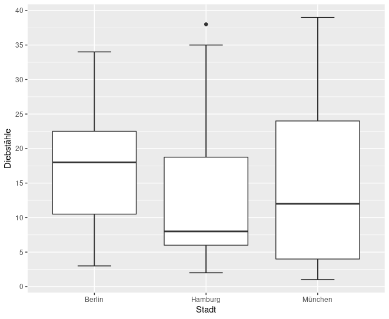

# Diagramme und Korrelaion in R
## Arbeitsumgebung vorbereiten

### Bibliotheken laden, Projektordner benennen und Daten einlesen
```
library(car) 
library(carData)
library(psych)
library(ggplot2)
library(boot)

setwd("/Pfad/zum/Projekt/Ganoven/")

Ganoven <- read.table("Ganoven.csv", header=T, sep=",", dec=".", fileEncoding="UTF-8-BOM")
```

## Auf fehlende Werte prüfen
### Abfragen, ob fehlende Werte enthalten sind
```
anyNA(Ganoven)
```
```
## TRUE
```
### Abfragen, in welchen Spalten diese Werte fehlen
```
sapply(Ganoven, anyNA)
```

```
##   ID Geschlecht Alter Stadt Diebstähle Gewaltpotenzial Vorbestraft 
##  FALSE      FALSE  TRUE FALSE      FALSE           FALSE        TRUE
```


## Histogramme erstellen
### Ein einfaches Histogramm
```
hist(Ganoven$Alter, xlab="Alter", ylab="Anzahl")
```


### ggplot Histogramm mit Ausschluss fehlender Werte
```
histogramm_alter <- ggplot(Ganoven, aes(Alter))
histogramm_alter + geom_histogram(na.rm = T, binwidth = 5) + labs(x="Alter", y="Häufigkeit")
```


## Empirisch kumulative Verteilung des Alters
```
plot.ecdf(Ganoven$Alter, main = "Kumulative Darstellung des Alters", xlab = "Alter")
```


## Boxplot: Diebstähle je Stadt
```
boxplot_Die_St <- ggplot(Ganoven, aes(x=Stadt, y=Diebstähle))
boxplot_Die_St + geom_boxplot()
boxplot_Die_St + stat_boxplot(geom="errorbar", width=.3) + geom_boxplot()
boxplot_Die_St + stat_boxplot(geom="errorbar", width=.3) + geom_boxplot() + labs(x="Stadt", y="Diebstähle") + scale_y_continuous(breaks=seq(0,50,5))
```


## Balkendiagramm zur Aufteilung der Geschlechtsausprägungen in den Städten
```
barplot_Alter <- ggplot(Ganoven, aes(x=Stadt))
barplot_Alter + geom_bar(position="dodge", aes(fill=Geschlecht)) + labs(x="Stadt", y="Anzahl", title="Aufteilung der Geschlechtsausprägung je Stadt") + scale_fill_manual(values=c("green", "blue", "red"))

```


## Korrelation und Regressionsgerade
### Scatterplot
```
# Scatterplot: Alter zu Diebstähle

scatter_Alter_Die <- ggplot(Ganoven, aes(x=Alter, y=Diebstähle))
scatter_Alter_Die + geom_point(na.rm=T, colour="blue", shape=4, size=3)
scatter_Alter_Die + geom_point(na.rm=T, colour="blue", shape=4, size=3) + labs(x="Alter", y="Diebstähle")
scatter_Alter_Die + geom_point(na.rm=T, colour="blue", shape=4, size=3, position="jitter") + labs(x="Alter", y="Diebstähle") + geom_smooth(method="lm", colour="red", se=TRUE) 
```


### Berechnung von Korrelation und Regressionsgerade
#### Allgemeine Informationen wie Mittelwert, Median und Standardabweichung bestimmen
```
describe(Ganoven, na.rm = T)
```
```
##                 vars  n  mean    sd median trimmed   mad min max range  skew kurtosis   se
## ID                 1 50 25.50 14.58   25.5   25.50 18.53   1  50    49  0.00    -1.27 2.06
## Geschlecht*        2 50  2.42  0.61    2.0    2.48  1.48   1   3     2 -0.50    -0.73 0.09
## Alter              3 48 33.33  8.36   34.0   33.02  7.41  16  59    43  0.46     0.62 1.21
## Stadt*             4 50  2.28  0.70    2.0    2.35  1.48   1   3     2 -0.43    -0.97 0.10
## Diebstähle         5 50 15.54 12.01   12.0   14.35 11.86   1  39    38  0.68    -0.89 1.70
## Gewaltpotenzial    6 50  3.34  1.24    3.0    3.42  1.48   1   5     4 -0.33    -0.87 0.18
## Vorbestraft*       7 44  1.43  0.50    1.0    1.42  0.00   1   2     1  0.27    -1.97 0.08
```
#### Berechnung der Regressionsgeraden
```
lm(Ganoven$Alter ~ Ganoven$Diebstähle)
```
```
## Call:
## lm(formula = Ganoven$Alter ~ Ganoven$Diebstähle)
##
## Coefficients:
##       (Intercept)  Ganoven$Diebstähle 
##           29.4198              0.2501  
```
```
# Berechnung des Korrelationskoeffizienten
cor(Ganoven$Alter, Ganoven$Diebstähle, use="pairwise.complete.obs")
```
```
## [1] 0.3638712
```


##  Bootstrapping
```
mean.Diebstähle <- function(Ganoven, i){mean(Ganoven$Diebstähle[i], na.rm=T)}
mean.Diebstähle.boot <- boot(Ganoven, mean.Diebstähle, 6000)
boot.ci(mean.Diebstähle.boot, type = "bca", conf=.98)
```

```
## BOOTSTRAP CONFIDENCE INTERVAL CALCULATIONS
## Based on 6000 bootstrap replicates
## 
## CALL : 
## boot.ci(boot.out = mean.Diebstähle.boot, conf = 0.98, type = "bca")
## 
## Intervals : 
## Level       BCa          
## 98%   (11.87, 19.53 )  
## Calculations and Intervals on Original Scale
```

```
cor.Alter_Die <- function(Ganoven, i){cor(Ganoven$Alter[i], Ganoven$Diebstähle[i], use = "pairwise.complete.obs")}
cor.Alter_Die.boot <- boot(Ganoven, cor.Alter_Die, 5000)
boot.ci(cor.Alter_Die.boot, type = "bca", conf=.95)
cor.Alter_Die.boot
```

```
## ORDINARY NONPARAMETRIC BOOTSTRAP
## 
## 
## Call:
## boot(data = Ganoven, statistic = cor.Alter_Die, R = 5000)
## 
## 
## Bootstrap Statistics :
##      original     bias    std. error
## t1* 0.3638712 0.00456655   0.1222358
```


